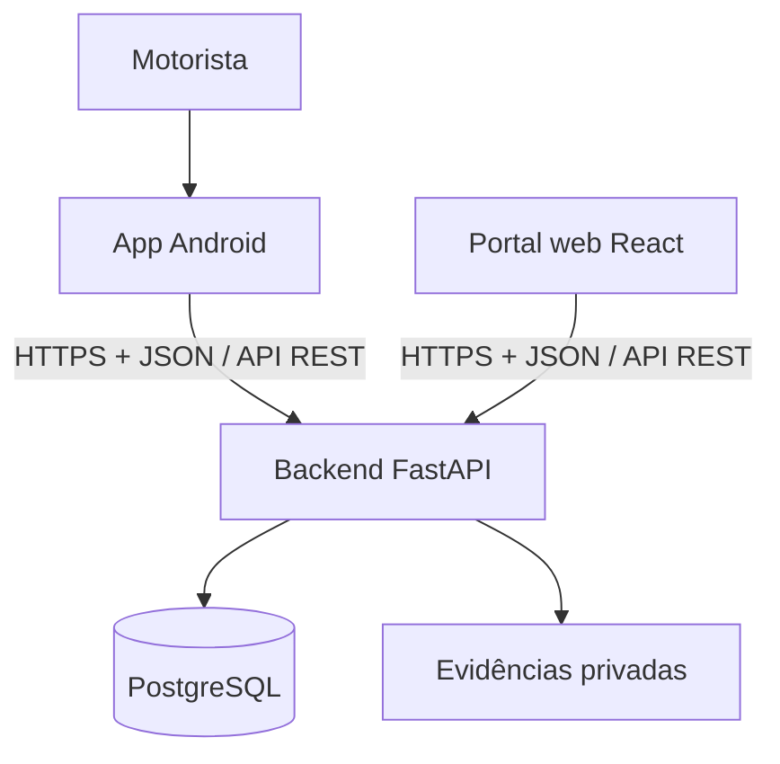

# RotaLog Mobile

Aplicativo Android operacional do **RotaLog**, destinado aos **motoristas responsáveis pelas coletas, rotas, tentativas de entrega, provas digitais e retornos** do marketplace B2B.

O app não é o canal de compra nem o painel do fornecedor. Compradores, fornecedores e operadores utilizam o portal web; o motorista utiliza este aplicativo para executar as etapas de campo autorizadas pelo backend.

> **Estado atual:** o repositório contém o projeto Android inicial com Kotlin, Jetpack Compose e Material 3. Autenticação, rede, captura de evidências e demais recursos serão implementados gradualmente conforme o Backlog.

## O que o aplicativo faz

Na demonstração, o aplicativo deverá permitir:

- login e renovação segura da sessão do motorista;
- consulta de rotas disponíveis ou atribuídas;
- visualização da sequência de paradas, endereço e janela de entrega;
- aceite e solicitação de início da rota;
- início da tentativa e registro dos contatos realizados;
- captura contextual de localização e foto;
- identificação e autorização do recebedor;
- captura de assinatura;
- registro de aceite, recusa ou tentativa não concluída;
- envio idempotente da prova e nova tentativa enquanto o app estiver aberto;
- retorno e transferência de custódia.

A demonstração é **online**. Persistência offline com Room e WorkManager, rastreamento contínuo por foreground service e envio de pontos em lotes pertencem à fase de piloto.

## Arquitetura e comunicação



O mobile e o frontend não trocam dados diretamente. A API coordena o fluxo:

1. a operação publica e atribui uma rota pelo portal;
2. o app consulta a rota autorizada e envia os comandos do motorista;
3. o backend valida sessão, organização, motorista, estado e idempotência;
4. GPS, foto e assinatura são enviados para endpoints autenticados;
5. o portal consulta o estado persistido e a timeline.

O OpenAPI do backend é o contrato canônico. Mudanças de endpoints ou schemas precisam ser compatíveis com o portal e o aplicativo. A baseline utiliza HTTP; WebSocket não é requisito.

## Stack

### Presente no repositório

| Área | Tecnologia/configuração |
|---|---|
| Linguagem | Kotlin 2.2.10 |
| UI | Jetpack Compose + Material 3 |
| Build | Gradle Wrapper 9.5.0 e Android Gradle Plugin 9.3.2 |
| SDK | `compileSdk 37`, `targetSdk 37`, `minSdk 29` |
| Compatibilidade Java do código | Java 11 |
| Testes | JUnit, AndroidX Test, Espresso e Compose UI Test |
| Pacote | `com.rotalog.delivery` |

### Baseline planejada

- ViewModel e StateFlow para estado de tela;
- Hilt para injeção de dependências;
- Retrofit, OkHttp e Kotlin Serialization para a API;
- DataStore para preferências;
- Android Keystore para refresh token e credenciais locais;
- Navigation Compose;
- CameraX e compressão local para fotos;
- Fused Location Provider para localização contextual;
- MockWebServer e testes instrumentados críticos.

No piloto serão adicionados Room, WorkManager e foreground service para fila offline e rastreamento durante rota ativa.

> **Atenção:** o documento técnico define compatibilidade mínima com Android API 26+, mas o projeto atual utiliza `minSdk 29`. Antes da release, a equipe deve decidir se reduzirá o `minSdk` para 26 e validar as funcionalidades nos dois níveis. Este README descreve o requisito executável atual: API 29+.

## Requisitos locais

- Git;
- Android Studio compatível com AGP 9.3.2;
- JDK 17 ou superior para executar o Gradle 9.5;
- Android SDK 37 instalado;
- dispositivo ou emulador com Android API 29 ou superior;
- acesso ao backend quando os fluxos de rede forem implementados.

## Configuração e execução local

### Android Studio

```bash
git clone https://github.com/Uninorte-Extensao/rotalog-mobile.git
```

1. Abra a pasta `rotalog-mobile` no Android Studio.
2. Aguarde o Gradle Sync e a instalação dos componentes de SDK solicitados.
3. Selecione um emulador ou dispositivo físico com API 29+.
4. Execute a configuração `app`.

### Linha de comando

Linux ou macOS:

```bash
cd rotalog-mobile
./gradlew assembleDebug
./gradlew installDebug
```

Windows:

```powershell
cd rotalog-mobile
.\gradlew.bat assembleDebug
.\gradlew.bat installDebug
```

O APK de debug é gerado em `app/build/outputs/apk/debug/`.

### Testes e verificações

```bash
./gradlew lint
./gradlew test
./gradlew connectedAndroidTest
```

`connectedAndroidTest` exige emulador ou dispositivo conectado. No Windows, substitua `./gradlew` por `.\gradlew.bat`.

Quando o cliente HTTP for implementado, a URL da API deverá ser configurada por build type ou flavor, sem endereço de produção ou secrets fixados no código.

## Organização prevista

A aplicação deve ser organizada por features e responsabilidades, mantendo UI, estado e integrações separadas. Uma estrutura possível é:

```text
app/src/main/java/com/rotalog/delivery/
  app/          # bootstrap, navegação e tema
  auth/         # login, sessão e credenciais
  routes/       # lista, detalhe, paradas e início
  delivery/     # tentativa, recebedor, prova e envio
  returns/      # recusa, retorno e custódia
  data/         # API, DTOs e persistência local
  shared/       # componentes e utilidades comuns
```

Os nomes finais podem evoluir com o código. Evite colocar regras de autorização do servidor na UI ou duplicar modelos do OpenAPI sem necessidade.

## Dados, permissões e segurança

- câmera e localização devem ser solicitadas apenas no contexto da tentativa;
- a finalidade deve ser explicada antes do prompt do sistema;
- negar uma permissão impede a prova completa, mas permite tentar novamente;
- fotos e assinaturas ficam em armazenamento privado temporário;
- tokens ficam protegidos pelo Android Keystore;
- logout remove credenciais e rascunhos não enviados após confirmação;
- a demonstração não solicita localização em background;
- no piloto, rastreamento só ocorre durante rota ativa e com notificação persistente;
- o foreground service deve encerrar a coleta ao finalizar, cancelar ou perder a atribuição da rota;
- logs não podem conter tokens, códigos de recebedor, assinaturas ou evidências.

## Distribuição

- releases devem ser assinadas com keystore fora do Git;
- APK/AAB deve ser identificado por versão e commit;
- a demonstração pode usar APK interno ou faixa de teste fechada;
- instalação e atualização devem ser ensaiadas nos dispositivos definidos.

## Repositórios relacionados

- Backend: https://github.com/Uninorte-Extensao/rotalog-backend
- Frontend: https://github.com/Uninorte-Extensao/rotalog-frontend
- Mobile: https://github.com/Uninorte-Extensao/rotalog-mobile
- Board de implementação: https://trello.com/b/4NmXZdXn/rotalogs

## Contribuição

1. Escolha uma task no Backlog e confirme o grupo de entrega.
2. Verifique o contrato OpenAPI e a versão mínima suportada.
3. Implemente estados de carregamento, erro, reenvio e permissões junto ao fluxo principal.
4. Execute lint, testes e `assembleDebug` antes do pull request.
5. Documente impactos de contrato ou dependências sobre backend e frontend.

